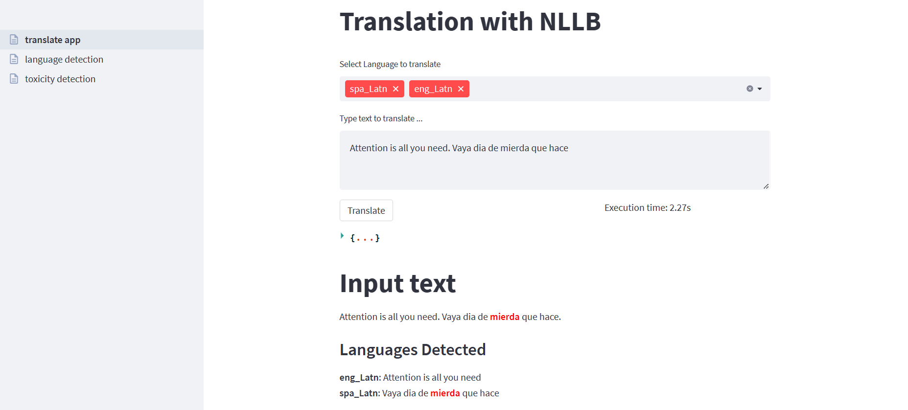

# Automatic Translation Frontend Application

Streamlit application that consumes the automatic translations tools API from: https://github.com/rosasalberto/automatic_translation_server



## Usage

1. Start automatic translations service: 
    - read https://github.com/rosasalberto/automatic_translation_server

2. Run streamlit application:
    ```console
    streamlit run translate_app.py
    ```